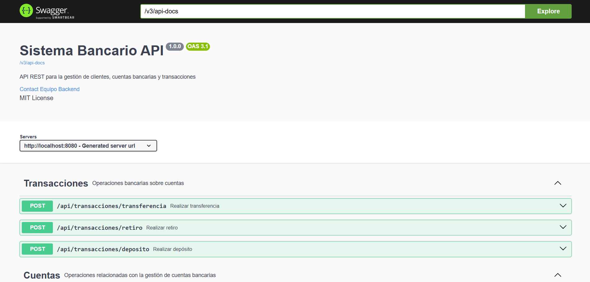
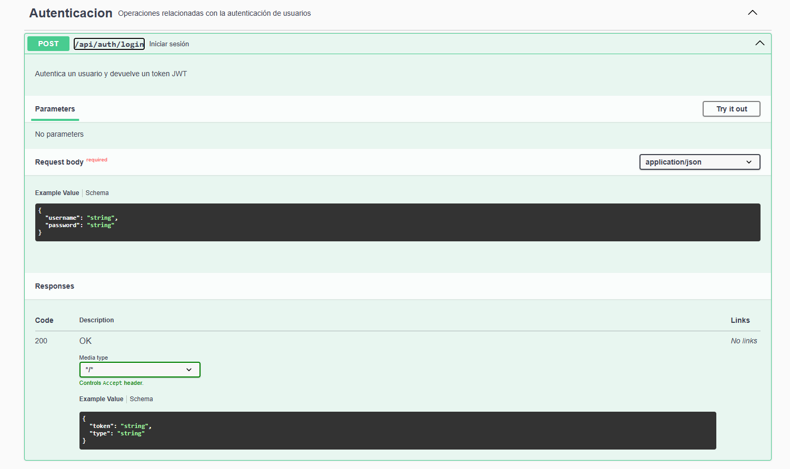
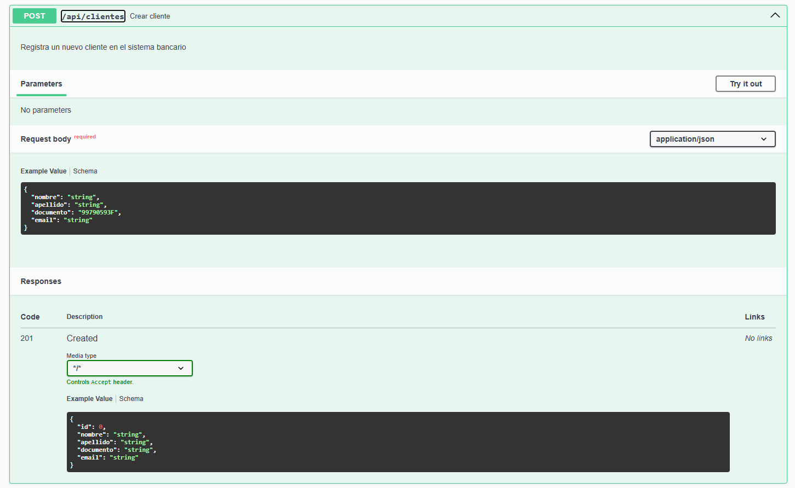
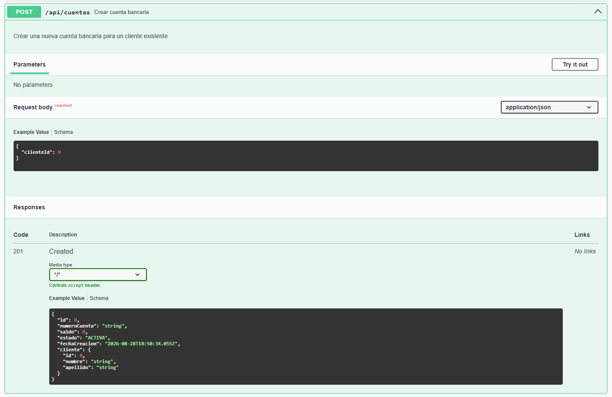
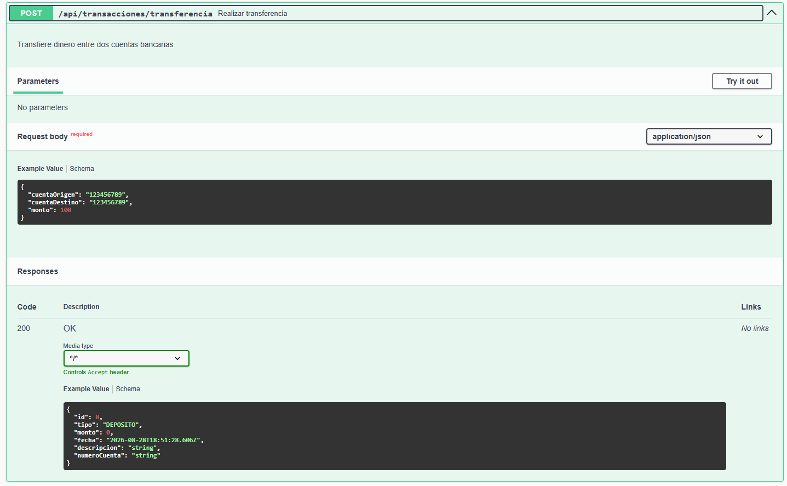
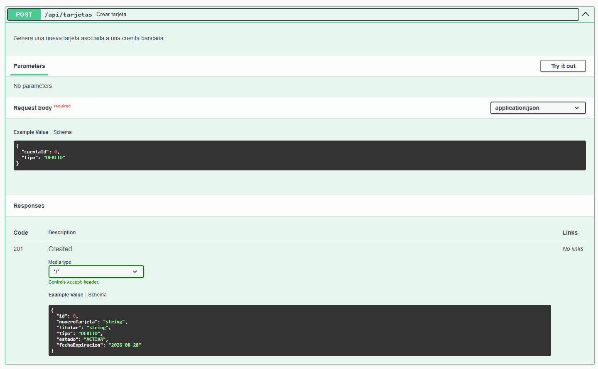
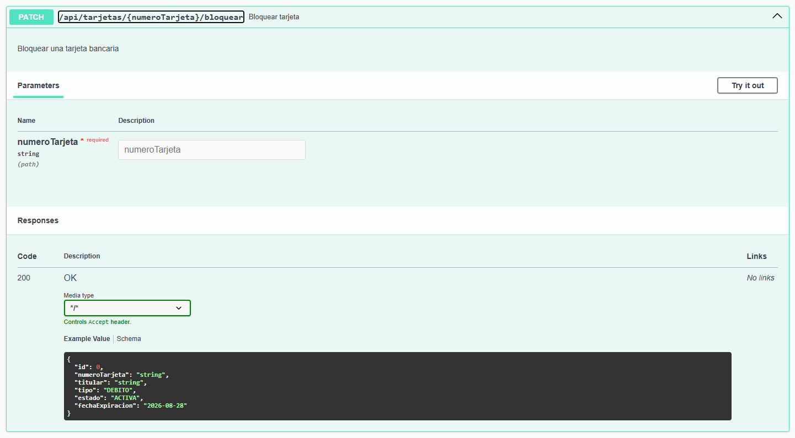
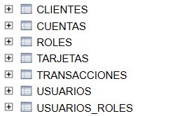
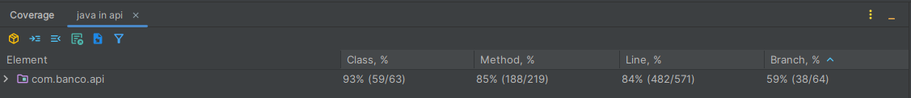

# 🏦 Sistema Bancario API

[](https://openjdk.org/)
[](https://spring.io/projects/spring-boot)
[](https://spring.io/projects/spring-security)
[](https://maven.apache.org/)
[](https://junit.org/junit5/)
[](https://site.mockito.org/)
[](LICENSE)

API REST desarrollada con **Spring Boot** que simula el funcionamiento de un sistema bancario. Permite gestionar clientes, cuentas bancarias, tarjetas, transacciones y autenticación mediante **JWT**, aplicando buenas prácticas de arquitectura, seguridad y testing.

---

# 📖 Tabla de contenidos

- Descripción
- Características
- Tecnologías
- Arquitectura
- Modelo de dominio
- Funcionalidades
- Seguridad
- Instalación
- Configuración
- Ejecución
- Documentación Swagger
- Base de datos
- Pruebas
- Estructura del proyecto
- Roadmap
- Autor
- Licencia

---

# 📌 Descripción

Este proyecto implementa una API REST para la gestión de un sistema bancario.

Su objetivo es ofrecer una arquitectura limpia, mantenible y escalable utilizando el ecosistema Spring.

La aplicación permite:

- Gestión de clientes.
- Gestión de cuentas bancarias.
- Gestión de tarjetas.
- Operaciones bancarias.
- Autenticación JWT.
- Control de acceso mediante roles.
- Validaciones de negocio.
- Gestión centralizada de errores.
- Documentación automática.

---

# ✨ Características

✔ Arquitectura por capas

✔ API REST

✔ DTOs

✔ MapStruct

✔ Spring Data JPA

✔ Hibernate

✔ Spring Security

✔ JWT

✔ Validaciones con Jakarta Validation

✔ Manejo global de excepciones

✔ Swagger/OpenAPI

✔ Base de datos H2

✔ Tests unitarios

✔ Tests de integración

✔ Mockito

✔ MockMvc

---

# 🛠 Tecnologías

| Tecnología | Versión |
|------------|----------|
| Java | 21 |
| Spring Boot | 3.x |
| Spring Security | 6 |
| Spring Data JPA | 3 |
| Hibernate | 6 |
| Maven | 3 |
| H2 Database | Última |
| JWT | jjwt |
| MapStruct | Última |
| Swagger OpenAPI | Última |
| JUnit 5 | Última |
| Mockito | Última |

---

# 🏛 Arquitectura

La aplicación sigue una arquitectura por capas.

```
                 Cliente HTTP
                      │
                      ▼
               REST Controllers
                      │
                      ▼
                 Service Layer
                      │
                      ▼
               Repository Layer
                      │
                      ▼
                  Base de datos
```

Cada capa tiene una única responsabilidad.

- Controller → expone la API.
- Service → implementa la lógica de negocio.
- Repository → acceso a datos.
- Entity → modelo persistente.
- DTO → comunicación con el cliente.
- Mapper → conversión Entity ↔ DTO.

---

# 📊 Modelo de dominio

El sistema está formado por las siguientes entidades:

```
Cliente
   │
   ├──────── Cuenta
                 │
                 ├──────── Tarjeta
                 │
                 └──────── Transacción
```

---

# 🚀 Funcionalidades

## Clientes

- Crear cliente
- Consultar cliente
- Listar clientes

---

## Cuentas

- Crear cuenta
- Consultar cuenta
- Consultar saldo

---

## Transacciones

- Depositar dinero
- Retirar dinero
- Transferir entre cuentas
- Consultar historial

---

## Tarjetas

- Crear tarjeta
- Consultar tarjeta
- Bloquear tarjeta

---

# 🔐 Seguridad

La autenticación se realiza mediante **JWT (JSON Web Token)**.

Después de autenticarse:

```
POST /api/auth/login
```

el servidor devuelve un token.

Las peticiones protegidas deben incluir:

```
Authorization: Bearer eyJhbGciOi...
```

### Roles

| Rol | Permisos |
|------|-----------|
| ADMIN | Acceso completo |
| EMPLEADO | Gestión bancaria |
| CLIENTE | Consulta de información |

---

# ⚙ Instalación

Clonar el proyecto

```bash
git clone https://github.com/TU_USUARIO/sistema-bancario-api.git
```

Entrar en el directorio

```bash
cd sistema-bancario-api
```

Compilar

```bash
mvn clean install
```

Ejecutar

```bash
mvn spring-boot:run
```

La aplicación estará disponible en

```
http://localhost:8080
```

---

# ⚙ Configuración

La aplicación utiliza H2 Database en memoria.

Configuración principal:

```
spring.datasource.url=jdbc:h2:mem:bancodb
spring.datasource.username=sa
spring.datasource.password=
```

Configuración JWT:

```
jwt.secret=********
jwt.issuer=BancoAPI
jwt.expiration=3600000
```

---

# 📚 Documentación Swagger

Una vez iniciada la aplicación:

```
http://localhost:8080/swagger-ui/index.html
```

Swagger permite:

- Consultar todos los endpoints.
- Ver ejemplos.
- Probar la API.
- Autenticarse mediante JWT.

### Vista de Swagger



---

## 🔐 Login



---

## 👤 Crear cliente



---

## 🏦 Crear cuenta



---

## 💰 Transferencia



---

## 💳 Crear tarjeta



---

## 🚫 Bloquear tarjeta



---

## 🗄️ Consola H2



---

## ✅ Cobertura de tests



---

# 🗄 Base de datos

Se utiliza H2 Database en memoria.

Consola:

```
http://localhost:8080/h2-console
```

Configuración:

```
JDBC URL:
jdbc:h2:mem:bancodb

Usuario:
sa

Contraseña:
(vacía)
```

---

# 🧪 Pruebas

El proyecto incluye:

- Tests unitarios.
- Tests de integración.
- Mockito.
- MockMvc.

Ejecutar:

```bash
mvn test
```

---

# 📂 Estructura del proyecto

```
src
├── main
│   ├── java
│   │
│   ├── config
│   ├── constants
│   ├── controller
│   ├── dto
│   ├── entity
│   ├── enums
│   ├── exception
│   ├── generator
│   ├── mapper
│   ├── repository
│   ├── security
│   ├── service
│   └── validation
│
└── test
    ├── controller
    ├── integration
    ├── mapper
    ├── repository
    └── service
```

---

# 📈 Estado del proyecto

✅ Proyecto funcional.

✅ CRUD completo.

✅ Seguridad JWT.

✅ Validaciones.

✅ Tests unitarios.

✅ Tests de integración.

---

# 🚀 Roadmap

Mejoras previstas:

- Docker.
- PostgreSQL.
- Refresh Tokens.
- Paginación.
- Auditoría.
- Redis.
- GitHub Actions.
- Despliegue en la nube.

---

# 👨‍💻 Autor

**manuel-d3v3lop3r**

Proyecto desarrollado como práctica de Backend con Spring Boot aplicando principios SOLID, arquitectura por capas, seguridad mediante JWT y pruebas automatizadas.

---
